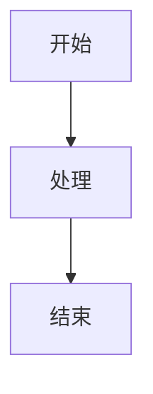

# 快速开始指南

## 🎯 您的项目已准备就绪!

Spring Cloud Alibaba 完整指南项目已成功创建并配置完成。

## 📦 项目位置

```
/Users/qingyu/springcloud-alibaba-intro
```

## 🚀 立即开始

### 1. 启动开发服务器

```bash
cd /Users/qingyu/springcloud-alibaba-intro/web
npm run dev
```

访问 http://localhost:5173 查看项目

### 2. 项目结构

```
springcloud-alibaba-intro/
├── web/                        # 前端项目
│   ├── src/
│   │   ├── data/              # ✅ 导航配置
│   │   ├── styles/            # ✅ 样式文件
│   │   ├── App.tsx            # ✅ 应用入口
│   │   └── main.tsx           # ✅ 主入口
├── README.md                   # ✅ 项目说明
├── 说明文档.md                 # ✅ 详细规划
└── PROJECT_SUMMARY.md          # ✅ 项目总结
```

## 📋 已完成的内容

✅ React + TypeScript + Vite 项目创建
✅ Tailwind CSS 配置
✅ 导航结构设计 (7 大板块,37 个页面)
✅ Spring Cloud Alibaba 主题配色
✅ Git 配置

## 🎨 下一步: 创建组件和页面

### 推荐的开发顺序

#### Step 1: 创建通用组件

```
web/src/components/
├── Layout.tsx          # 主布局
├── Sidebar.tsx         # 侧边栏
├── Header.tsx          # 头部
├── Footer.tsx          # 底部
└── CodeBlock.tsx       # 代码块
```

#### Step 2: 创建首页

```
web/src/pages/
└── IndexPage.tsx       # 项目首页
```

#### Step 3: 创建文档页面

参考 langchain4j-intro 项目的页面结构:
```
web/src/pages/
├── GettingStartedPage.tsx
├── CoreConceptsPage.tsx
├── NacosPage.tsx
└── ...
```

## 💡 参考资源

### 参考项目

```bash
# 原参考项目
cd /Users/qingyu/langchain4j-intro

# UI/UX Skill 项目
cd /tmp/ui-ux-pro-max-skill
```

### 官方文档

- Spring Cloud Alibaba: https://sca.aliyun.com
- React 文档: https://react.dev
- Tailwind CSS: https://tailwindcss.com
- Vite 文档: https://vite.dev

## 🎯 使用 UI/UX Pro Max Skill

当您需要创建或优化 UI 时,可以这样使用:

1. **激活 Skill**:
   ```
   /plugin marketplace add nextlevelbuilder/ui-ux-pro-max-skill
   /plugin install ui-ux-pro-max@ui-ux-pro-max-skill
   ```

2. **自然语言描述需求**:
   ```
   创建一个现代化的文档页面布局,包含侧边栏导航和代码高亮
   ```

3. **Skill 会自动**:
   - 分析您的需求
   - 生成设计系统
   - 提供代码实现

## 📝 内容创作提示

### 页面结构模板

```tsx
export default function ComponentNamePage() {
  return (
    <div className="prose prose-slate max-w-none">
      <h1>页面标题</h1>

      <section>
        <h2>简介</h2>
        <p>内容描述...</p>
      </section>

      <section>
        <h2>核心概念</h2>
        <p>概念讲解...</p>
      </section>

      <section>
        <h2>代码示例</h2>
        <pre><code className="language-java">// Java 代码</code></pre>
      </section>

      <section>
        <h2>最佳实践</h2>
        <ul>
          <li>实践 1</li>
          <li>实践 2</li>
        </ul>
      </section>
    </div>
  );
}
```

### 添加 Mermaid 图表

````markdown

````

## 🔧 开发命令

```bash
# 开发
npm run dev

# 构建
npm run build

# 预览构建
npm run preview

# Lint 检查
npm run lint
```

## 🎨 自定义样式

主要样式文件: `web/src/styles/main.css`

可以自定义:
- 颜色变量
- 字体设置
- 组件样式
- 响应式断点

## 📊 项目规划详情

查看 `说明文档.md` 了解:
- 完整的内容规划
- 技术架构说明
- 开发阶段划分
- 编码规范

## 🤝 需要帮助?

1. 查看 `PROJECT_SUMMARY.md` - 项目现状总结
2. 查看 `说明文档.md` - 完整规划文档
3. 参考原项目 `/Users/qingyu/langchain4j-intro`

## 🎉 开始创作!

现在您可以:

1. ✅ 启动开发服务器
2. ✅ 创建通用组件
3. ✅ 编写文档内容
4. ✅ 添加代码示例
5. ✅ 集成 UI/UX Pro Max Skill

祝您开发愉快! 🚀

---

**项目路径**: `/Users/qingyu/springcloud-alibaba-intro`
**前端路径**: `/Users/qingyu/springcloud-alibaba-intro/web`
**开发端口**: http://localhost:5173
