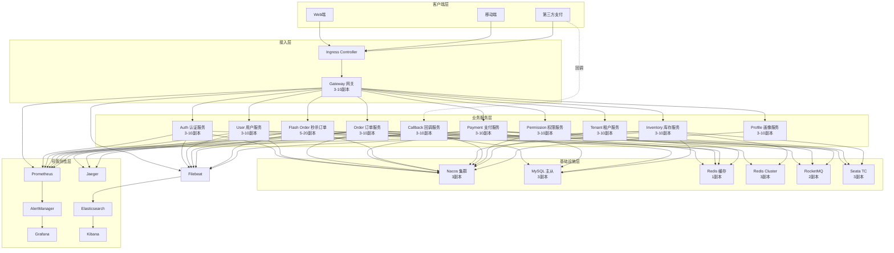
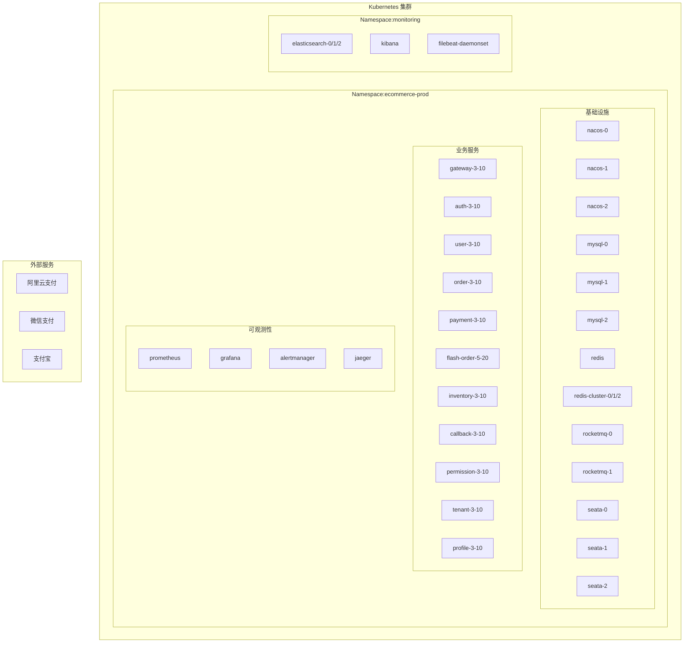
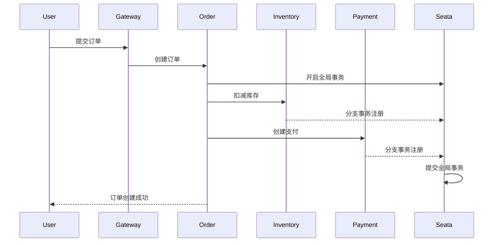
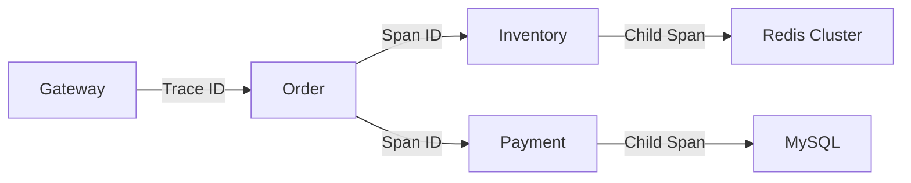
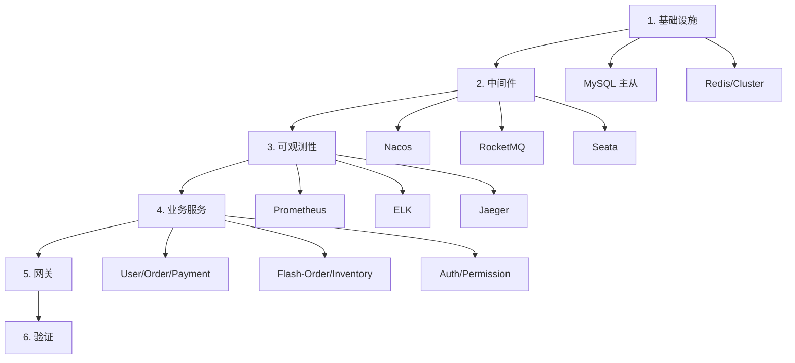

# 综合微服务系统 - 架构设计文档

## 1. 系统概述

### 1.1 系统简介

本项目是一个完整的电商微服务生态系统，整合了电商交易、秒杀抢购、支付结算、用户管理等核心业务模块，采用 Spring Cloud Alibaba 技术栈，支持多租户、分布式事务、高并发等企业级特性。

### 1.2 核心特性

- **完整的微服务生态**: 15+ 业务服务，覆盖电商全链路
- **多租户支持**: 基于 tenant_id 数据隔离，支持 SaaS 化
- **分布式事务**: Seata 保证跨服务数据一致性
- **高并发能力**: 秒杀服务支持 10,000+ QPS
- **全链路可观测性**: 监控、日志、链路追踪三位一体
- **自动化运维**: GitLab CI 全自动部署流程
- **高可用架构**: 所有服务支持 HPA，最小 3 副本

### 1.3 服务清单

#### 基础设施服务 (6个)
| 服务名称 | 类型 | 副本数 | 职责 |
|---------|------|--------|------|
| Nacos | 配置中心/注册中心 | 3 | 服务发现、配置管理 |
| MySQL | 关系型数据库 | 3 | 主从复制，业务数据存储 |
| Redis | 缓存 | 1 | 会话、热点数据缓存 |
| Redis Cluster | 分布式缓存 | 3 | 秒杀库存扣减 |
| RocketMQ | 消息队列 | 2 | 异步解耦、流量削峰 |
| Seata | 分布式事务 | 3 | 全局事务协调 |

#### 业务服务 (15个)
| 服务名称 | 类型 | 副本数 | 职责 |
|---------|------|--------|------|
| Gateway | 网关 | 3-10 | 统一入口、路由、限流 |
| Order Service | 订单服务 | 3-10 | 订单创建、管理 |
| User Service | 用户服务 | 3-10 | 用户信息管理 |
| Payment Service | 支付服务 | 3-10 | 支付核心逻辑 |
| Flash Order Service | 秒杀订单 | 5-20 | 秒杀订单处理 |
| Inventory Service | 库存服务 | 3-10 | 库存管理、预扣减 |
| Callback Service | 回调服务 | 3-10 | 第三方支付回调 |
| Reconciliation Service | 对账服务 | 1 | 定时对账任务 |
| Auth Service | 认证服务 | 3-10 | SSO 单点登录 |
| Permission Service | 权限服务 | 3-10 | RBAC 权限控制 |
| Tenant Service | 租户服务 | 3-10 | 多租户管理 |
| Profile Service | 画像服务 | 3-10 | 用户画像分析 |

#### 可观测性服务 (7个)
| 服务名称 | 类型 | 副本数 | 职责 |
|---------|------|--------|------|
| Prometheus | 监控 | 1 | 指标采集、存储 |
| Grafana | 可视化 | 1 | 监控大盘 |
| AlertManager | 告警 | 1 | 告警路由、通知 |
| Elasticsearch | 日志存储 | 3 | 日志索引、检索 |
| Kibana | 日志分析 | 1 | 日志可视化 |
| Filebeat | 日志采集 | DaemonSet | 日志收集 |
| Jaeger | 链路追踪 | 1 | 分布式追踪 |

## 2. 架构设计

### 2.1 整体架构图



### 2.2 部署架构图



## 3. 核心设计

### 3.1 多租户设计

#### 租户隔离策略
- **数据隔离**: 基于 tenant_id 字段逻辑隔离
- **资源隔离**: 按租户分配资源配额
- **配置隔离**: 租户级配置参数
- **权限隔离**: 租户数据不可见

#### 数据库设计
```sql
-- 所有业务表增加租户字段
ALTER TABLE orders ADD COLUMN tenant_id BIGINT NOT NULL;
ALTER TABLE users ADD COLUMN tenant_id BIGINT NOT NULL;
ALTER TABLE payments ADD COLUMN tenant_id BIGINT NOT NULL;

-- 租户表
CREATE TABLE tenants (
    id BIGINT PRIMARY KEY,
    name VARCHAR(100),
    status TINYINT,
    quota_config JSON,
    created_at DATETIME
);

-- 租户数据隔离中间件
@Interceptor(tenantIdInterceptor)
public class TenantContext {
    private static ThreadLocal<Long> tenantId = new ThreadLocal<>();
}
```

### 3.2 分布式事务设计

#### 事务模式
- **AT 模式**: 默认模式，自动补偿
- **TCC 模式**: 秒杀场景，性能优先
- **SAGA 模式**: 长事务，状态机管理

#### 典型事务流程


### 3.3 高并发设计

#### 秒杀系统优化
- **缓存预热**: 活动前预加载库存到 Redis Cluster
- **库存扣减**: Redis Lua 脚本原子操作
- **流量削峰**: RocketMQ 异步处理订单
- **快速扩容**: HPA 基于 CPU/内存/QPS 自动扩容

#### 性能指标
- **秒杀 QPS**: 10,000+
- **响应时间**: P99 < 100ms
- **可用性**: 99.99%

```yaml
# HPA 配置示例
apiVersion: autoscaling/v2
kind: HorizontalPodAutoscaler
metadata:
  name: flash-order-hpa
spec:
  scaleTargetRef:
    apiVersion: apps/v1
    kind: Deployment
    name: flash-order-service
  minReplicas: 5
  maxReplicas: 20
  metrics:
  - type: Resource
    resource:
      name: cpu
      target:
        type: Utilization
        averageUtilization: 70
  - type: Pods
    pods:
      metric:
        name: qps
      target:
        type: AverageValue
        averageValue: "500"
  behavior:
    scaleUp:
      stabilizationWindowSeconds: 30
      policies:
      - type: Percent
        value: 100
        periodSeconds: 15
    scaleDown:
      stabilizationWindowSeconds: 300
      policies:
      - type: Percent
        value: 50
        periodSeconds: 60
```

### 3.4 可观测性设计

#### 三大支柱
1. **Metrics (监控)**: Prometheus + Grafana
2. **Logs (日志)**: ELK Stack
3. **Traces (追踪)**: Jaeger

#### 监控指标体系
```yaml
业务指标:
  - 订单量 (orders_total)
  - 支付成功率 (payment_success_rate)
  - 秒杀 QPS (flash_sale_qps)
  - 库存准确率 (inventory_accuracy)

性能指标:
  - 请求延迟 (request_duration)
  - 吞吐量 (request_throughput)
  - 错误率 (error_rate)

资源指标:
  - CPU 使用率 (cpu_usage)
  - 内存使用率 (memory_usage)
  - 网络流量 (network_traffic)
```

#### 链路追踪


## 4. 部署策略

### 4.1 部署模式

#### 蓝绿部署
- 适用场景: 基础设施服务 (MySQL, Redis, Nacos)
- 优点: 零停机、快速回滚
- 缺点: 资源占用翻倍

#### 金丝雀部署
- 适用场景: 业务服务 (Order, Payment)
- 优点: 渐进式发布、风险可控
- 缺点: 流量控制复杂

#### 滚动更新
- 适用场景: 无状态服务 (Gateway, Auth)
- 优点: 资源利用率高
- 缺点: 回滚较慢

### 4.2 部署顺序



### 4.3 资源规划

#### 节点规划 (3节点集群)
```yaml
Node1 (Master + Infra):
  - MySQL (3副本)
  - Redis Cluster
  - Elasticsearch (3副本)

Node2 (Master + Business):
  - Nacos (3副本)
  - RocketMQ (2副本)
  - 业务服务 (15个)

Node3 (Worker + Business):
  - Seata (3副本)
  - 业务服务 (15个)
  - 监控服务
```

#### 资源配额
```yaml
Namespace: ecommerce-prod
  ResourceQuota:
    requests.cpu: "20"
    requests.memory: 40Gi
    limits.cpu: "40"
    limits.memory: 80Gi
    persistentvolumeclaims: "30"
```

## 5. 安全设计

### 5.1 网络隔离
- Network Policy: 限制 Pod 间通信
- Service Mesh: mTLS 加密
- Ingress: TLS 证书、HTTPS

### 5.2 认证授权
- OAuth2 + JWT: 统一认证
- RBAC: Kubernetes 集群权限
- ServiceAccount: Pod 身份认证

### 5.3 数据安全
- 敏感数据: Secrets + Vault
- 传输加密: TLS/mTLS
- 存储加密: 数据库加密、PV 加密

## 6. 灾备设计

### 6.1 高可用
- 服务副本: 最小 3 副本
- 反亲和性: 跨节点部署
- 健康检查: Liveness + Readiness

### 6.2 备份恢复
- 数据备份: 定时全量 + 增量
- 配置备份: Git 版本控制
- 容灾演练: 定期故障演练

## 7. 监控告警

### 7.1 告警级别
- **P0 严重**: 服务不可用、数据丢失
- **P1 重要**: 性能严重下降、错误率突增
- **P2 警告**: 资源使用率过高、容量告警
- **P3 提示**: 非关键异常、需要关注

### 7.2 告警规则
详见 `monitoring/prometheus/prometheus-rule.yaml`

## 8. 故障演练

### 8.1 混沌工程
- Pod 随机杀杀: 模拟节点故障
- 网络延迟: 模拟网络拥塞
- 资源限制: 模拟资源不足

### 8.2 故障恢复
- 自动扩容: HPA 快速响应
- 自动迁移: Pod 驱逐
- 自动回滚: Deployment 回滚

## 9. 技术栈

### 9.1 开发框架
- Spring Cloud Alibaba: 2022.x
- Spring Boot: 3.x
- Java: 17

### 9.2 中间件
- Nacos: 2.2.x
- Sentinel: 1.8.x
- Seata: 1.7.x
- RocketMQ: 5.x
- Redis: 7.x
- MySQL: 8.0

### 9.3 容器平台
- Kubernetes: 1.28+
- Docker: 24.x
- Containerd: 1.7.x

### 9.4 可观测性
- Prometheus: 2.47+
- Grafana: 10.x
- Elasticsearch: 8.x
- Jaeger: 1.50+

## 10. 最佳实践

### 10.1 开发规范
- API 设计: RESTful + 版本控制
- 代码质量: SonarQube 扫描
- 单元测试: 覆盖率 > 80%
- 文档: OpenAPI/Swagger

### 10.2 运维规范
- 变更管理: GitOps 工作流
- 发布策略: 自动化 CI/CD
- 监控告警: 全方位覆盖
- 故障处理: On-call 机制

### 10.3 安全规范
- 代码扫描: 依赖漏洞检查
- 镜像扫描: Trivy 漏洞扫描
- 权限最小化: 最小权限原则
- 审计日志: 操作审计
