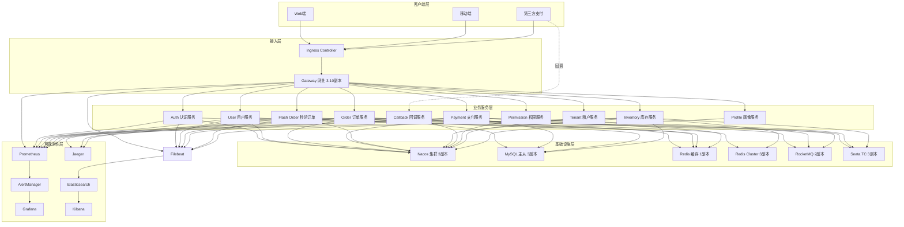

# 综合微服务系统 - Kubernetes 部署方案

## 项目简介

这是一个基于 Spring Cloud Alibaba 的完整微服务生态系统，整合了电商交易、秒杀抢购、支付结算、用户管理等核心业务模块，提供生产级的 Kubernetes 部署方案。

### 核心特性

- **完整的微服务生态**: 15+ 业务服务，覆盖电商全链路
- **多租户支持**: 基于 tenant_id 数据隔离，支持 SaaS 化
- **分布式事务**: Seata 保证跨服务数据一致性
- **高并发能力**: 秒杀服务支持 10,000+ QPS
- **全链路可观测性**: 监控、日志、链路追踪三位一体
- **自动化运维**: GitLab CI 全自动部署流程
- **高可用架构**: 所有服务支持 HPA，最小 3 副本

## 系统架构



## 服务清单

### 基础设施服务 (6个)

| 服务名称 | 类型 | 副本数 | 职责 |
|---------|------|--------|------|
| Nacos | 配置中心/注册中心 | 3 | 服务发现、配置管理 |
| MySQL | 关系型数据库 | 3 | 主从复制，业务数据存储 |
| Redis | 缓存 | 1 | 会话、热点数据缓存 |
| Redis Cluster | 分布式缓存 | 3 | 秒杀库存扣减 |
| RocketMQ | 消息队列 | 2 | 异步解耦、流量削峰 |
| Seata | 分布式事务 | 3 | 全局事务协调 |

### 业务服务 (15个)

| 服务名称 | 类型 | 副本数 | 职责 |
|---------|------|--------|------|
| Gateway | 网关 | 3-10 | 统一入口、路由、限流 |
| Order Service | 订单服务 | 3-10 | 订单创建、管理 |
| User Service | 用户服务 | 3-10 | 用户信息管理 |
| Payment Service | 支付服务 | 3-10 | 支付核心逻辑 |
| Flash Order Service | 秒杀订单 | 5-20 | 秒杀订单处理 |
| Inventory Service | 库存服务 | 3-10 | 库存管理、预扣减 |
| Callback Service | 回调服务 | 3-10 | 第三方支付回调 |
| Reconciliation Service | 对账服务 | 1 | 定时对账任务 |
| Auth Service | 认证服务 | 3-10 | SSO 单点登录 |
| Permission Service | 权限服务 | 3-10 | RBAC 权限控制 |
| Tenant Service | 租户服务 | 3-10 | 多租户管理 |
| Profile Service | 画像服务 | 3-10 | 用户画像分析 |

### 可观测性服务 (7个)

| 服务名称 | 类型 | 副本数 | 职责 |
|---------|------|--------|------|
| Prometheus | 监控 | 1 | 指标采集、存储 |
| Grafana | 可视化 | 1 | 监控大盘 |
| AlertManager | 告警 | 1 | 告警路由、通知 |
| Elasticsearch | 日志存储 | 3 | 日志索引、检索 |
| Kibana | 日志分析 | 1 | 日志可视化 |
| Filebeat | 日志采集 | DaemonSet | 日志收集 |
| Jaeger | 链路追踪 | 1 | 分布式追踪 |

## 快速开始

### 前置条件

- Kubernetes 1.28+
- Helm 3.x
- kubectl 1.28+
- Docker 24.x
- GitLab CI/CD (可选)

### 1. 克隆项目

```bash
git clone https://github.com/your-org/springcloud-alibaba-intro.git
cd springcloud-alibaba-intro/deployment-examples/comprehensive
```

### 2. 配置环境变量

```bash
cp .env.example .env
# 编辑 .env 文件，配置必要的环境变量
```

### 3. 部署基础设施

```bash
# 方式一：使用部署脚本（推荐）
./deploy.sh init

# 方式二：手动部署
kubectl apply -f k8s/00-namespace.yaml
kubectl apply -f k8s/mysql/
kubectl apply -f k8s/redis/
kubectl apply -f k8s/nacos/
kubectl apply -f k8s/rocketmq/
kubectl apply -f k8s/seata/
```

### 4. 部署可观测性

```bash
./deploy.sh monitoring
```

### 5. 部署业务服务

```bash
./deploy.sh services
```

### 6. 部署网关

```bash
./deploy.sh gateway
```

### 7. 验证部署

```bash
./deploy.sh verify
```

## 架构设计决策

### 1. 微服务拆分原则

- **业务边界**: 按业务领域拆分 (DDD)
- **数据独立**: 每个服务独立数据库
- **部署独立**: 服务可独立部署、扩容
- **技术异构**: 允许不同服务使用不同技术

### 2. 多租户设计

#### 租户隔离策略

- **数据隔离**: 基于 `tenant_id` 字段逻辑隔离
- **资源隔离**: 按租户分配资源配额
- **配置隔离**: 租户级配置参数
- **权限隔离**: 租户数据不可见

#### 数据库设计

```sql
-- 所有业务表增加租户字段
ALTER TABLE orders ADD COLUMN tenant_id BIGINT NOT NULL;
ALTER TABLE users ADD COLUMN tenant_id BIGINT NOT NULL;
ALTER TABLE payments ADD COLUMN tenant_id BIGINT NOT NULL;

-- 租户表
CREATE TABLE tenants (
    id BIGINT PRIMARY KEY,
    name VARCHAR(100),
    status TINYINT,
    quota_config JSON,
    created_at DATETIME
);
```

### 3. 分布式事务设计

#### 事务模式

- **AT 模式**: 默认模式，自动补偿
- **TCC 模式**: 秒杀场景，性能优先
- **SAGA 模式**: 长事务，状态机管理

#### 典型事务流程

1. 用户提交订单
2. Order Service 开启全局事务
3. 扣减库存 (Inventory Service)
4. 创建支付 (Payment Service)
5. Seata 协调提交/回滚

### 4. 高并发设计

#### 秒杀系统优化

- **缓存预热**: 活动前预加载库存到 Redis Cluster
- **库存扣减**: Redis Lua 脚本原子操作
- **流量削峰**: RocketMQ 异步处理订单
- **快速扩容**: HPA 基于 CPU/内存/QPS 自动扩容

#### 性能指标

- **秒杀 QPS**: 10,000+
- **响应时间**: P99 < 100ms
- **可用性**: 99.99%

### 5. 可观测性设计

#### 三大支柱

1. **Metrics (监控)**: Prometheus + Grafana
2. **Logs (日志)**: ELK Stack
3. **Traces (追踪)**: Jaeger

#### 监控指标体系

- **业务指标**: 订单量、支付成功率、秒杀 QPS
- **性能指标**: 请求延迟、吞吐量、错误率
- **资源指标**: CPU、内存、网络

## 部署策略

### 1. 蓝绿部署

- **适用场景**: 基础设施服务 (MySQL, Redis, Nacos)
- **优点**: 零停机、快速回滚
- **缺点**: 资源占用翻倍

### 2. 金丝雀部署

- **适用场景**: 业务服务 (Order, Payment)
- **优点**: 渐进式发布、风险可控
- **缺点**: 流量控制复杂

### 3. 滚动更新

- **适用场景**: 无状态服务 (Gateway, Auth)
- **优点**: 资源利用率高
- **缺点**: 回滚较慢

## 监控告警

### 告警级别

- **P0 严重**: 服务不可用、数据丢失
- **P1 重要**: 性能严重下降、错误率突增
- **P2 警告**: 资源使用率过高、容量告警
- **P3 提示**: 非关键异常、需要关注

### 告警规则

详见 `monitoring/prometheus/prometheus-rule.yaml`，包含 50+ 告警规则：

- 业务告警 (20条): 订单量异常、支付失败率、库存异常
- 性能告警 (15条): 响应时间、错误率、QPS 异常
- 资源告警 (10条): CPU、内存、磁盘、网络
- 基础设施告警 (5条): MySQL、Redis、RocketMQ

### Grafana Dashboard

- **系统概览**: 整体系统健康度
- **业务监控**: 订单、支付、秒杀专项监控
- **服务监控**: 各服务性能指标
- **基础设施**: MySQL、Redis、RocketMQ 监控
- **多租户**: 租户级监控
- **链路追踪**: Jaeger 集成

## 故障演练

### 混沌工程

- **Pod 随机杀杀**: 模拟节点故障
- **网络延迟**: 模拟网络拥塞
- **资源限制**: 模拟资源不足

### 故障恢复

- **自动扩容**: HPA 快速响应
- **自动迁移**: Pod 驱逐
- **自动回滚**: Deployment 回滚

## 运维指南

### 日常运维

```bash
# 查看服务状态
kubectl get pods -n ecommerce-prod

# 查看日志
kubectl logs -f deployment/order-service -n ecommerce-prod

# 扩容服务
kubectl scale deployment order-service --replicas=5 -n ecommerce-prod

# 查看监控
kubectl port-forward svc/prometheus 9090:9090 -n monitoring
```

### 故障排查

```bash
# 查看 Pod 详情
kubectl describe pod order-service-xxx -n ecommerce-prod

# 查看事件
kubectl get events -n ecommerce-prod --sort-by='.lastTimestamp'

# 查看日志
kubectl logs order-service-xxx -n ecommerce-prod --previous

# 进入容器调试
kubectl exec -it order-service-xxx -n ecommerce-prod -- /bin/bash
```

### 备份恢复

```bash
# MySQL 备份
kubectl exec mysql-0 -n ecommerce-prod -- mysqldump -u root -p ecommerce > backup.sql

# Redis 备份
kubectl exec redis-0 -n ecommerce-prod -- redis-cli SAVE

# 恢复
kubectl exec -i mysql-0 -n ecommerce-prod -- mysql -u root -p ecommerce < backup.sql
```

## CI/CD

### GitLab CI 流水线

详见 `cicd/.gitlab-ci.yml`

- **构建阶段**: Maven 编译、Docker 镜像构建
- **测试阶段**: 单元测试、集成测试、安全扫描
- **部署阶段**: 自动部署到 K8s、金丝雀发布
- **验证阶段**: 自动化测试、性能测试

### 部署流程

1. 开发提交代码
2. GitLab CI 自动构建
3. 自动运行测试
4. 构建 Docker 镜像
5. 推送到镜像仓库
6. 自动部署到 K8s
7. 健康检查验证
8. 金丝雀发布 (可选)

## 技术栈

### 开发框架

- Spring Cloud Alibaba: 2022.x
- Spring Boot: 3.x
- Java: 17

### 中间件

- Nacos: 2.2.x
- Sentinel: 1.8.x
- Seata: 1.7.x
- RocketMQ: 5.x
- Redis: 7.x
- MySQL: 8.0

### 容器平台

- Kubernetes: 1.28+
- Docker: 24.x
- Containerd: 1.7.x

### 可观测性

- Prometheus: 2.47+
- Grafana: 10.x
- Elasticsearch: 8.x
- Jaeger: 1.50+

## 文档索引

- [架构设计](ARCHITECTURE.md) - 详细架构设计文档
- [部署指南](DEPLOYMENT.md) - 部署步骤说明
- [检查清单](CHECKLIST.md) - 部署前后检查清单
- [运维手册](docs/OPERATIONS.md) - 日常运维操作
- [故障处理](docs/TROUBLESHOOTING.md) - 常见问题排查

## 最佳实践

### 开发规范

- API 设计: RESTful + 版本控制
- 代码质量: SonarQube 扫描
- 单元测试: 覆盖率 > 80%
- 文档: OpenAPI/Swagger

### 运维规范

- 变更管理: GitOps 工作流
- 发布策略: 自动化 CI/CD
- 监控告警: 全方位覆盖
- 故障处理: On-call 机制

### 安全规范

- 代码扫描: 依赖漏洞检查
- 镜像扫描: Trivy 漏洞扫描
- 权限最小化: 最小权限原则
- 审计日志: 操作审计

## 常见问题

### Q1: 部署失败怎么办？

```bash
# 检查 Pod 状态
kubectl get pods -n ecommerce-prod

# 查看 Pod 详情
kubectl describe pod <pod-name> -n ecommerce-prod

# 查看日志
kubectl logs <pod-name> -n ecommerce-prod
```

### Q2: 如何回滚部署？

```bash
# 查看部署历史
kubectl rollout history deployment/order-service -n ecommerce-prod

# 回滚到上一版本
kubectl rollout undo deployment/order-service -n ecommerce-prod

# 回滚到指定版本
kubectl rollout undo deployment/order-service --to-revision=2 -n ecommerce-prod
```

### Q3: 如何扩容服务？

```bash
# 手动扩容
kubectl scale deployment order-service --replicas=10 -n ecommerce-prod

# 自动扩容 (HPA)
kubectl autoscale deployment order-service --min=3 --max=10 --cpu-percent=70 -n ecommerce-prod
```

## 贡献指南

欢迎提交 Issue 和 Pull Request！

## 许可证

Apache License 2.0

## 联系方式

- Email: support@example.com
- GitHub: https://github.com/your-org/springcloud-alibaba-intro
- 文档: https://docs.example.com
